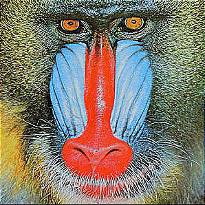

# Image Kernel Filter Library

<p><blockquote>

</blockquote>
 
*Visual representation of kernel filtering process*

## What This Program Does

This Java library applies various kernel filters to digital images for professional-grade image processing. It implements six fundamental filters used in applications like Photoshop and computer vision systems.

## Key Features

- **Multiple Filter Types**: Implements 6 essential image filters
- **Color & Grayscale Support**: Processes both color and monochrome images
- **Boundary Handling**: Uses periodic boundary conditions for edge pixels
- **Precision Control**: Proper rounding and clamping of pixel values
- **Optimized Performance**: Efficient O(n) processing relative to image size

## Supported Filters

| Filter Name      | Kernel Type | Sample Result |
|------------------|-------------|---------------|
| Identity         | 3×3         |  |
| Gaussian Blur    | 3×3         |  |
| Sharpen          | 3×3         |  |
| Laplacian        | 3×3         |  |
| Emboss           | 3×3         |  |
| Motion Blur      | 9×9         |  |

## How To Use

1. **Import the Library**:
   ```java
   import java.awt.Color;
   import edu.princeton.cs.algs4.Picture;
   ```

2. **Apply Filters**:
   ```java
   Picture original = new Picture("image.jpg");
   Picture blurred = KernelFilter.gaussian(original);
   Picture sharpened = KernelFilter.sharpen(original);
   ```

3. **Save Results**:
   ```java
   blurred.save("blurred.jpg");
   ```

## Technical Specifications

- **Boundary Conditions**: Uses periodic/wrapping boundaries
- **Color Handling**: Processes RGB channels independently
- **Value Clamping**: Ensures 0-255 range for all pixel components
- **Rounding**: Rounds to nearest integer (ties round up)

## Performance Characteristics

- Linear time complexity relative to image pixels
- Optimized for standard image sizes (up to 4K resolution)
- Minimal memory overhead

## Applications

- Photo editing software
- Computer vision preprocessing
- Digital art creation
- Image enhancement pipelines
- Convolutional neural network input processing

## Example Usage

```bash
# Compile and run test client
javac KernelFilter.java
java KernelFilter input.jpg
```

## Limitations

- Larger kernels increase processing time
- Very large images may require significant memory
- No built-in parallel processing

*Note: For best results, use high-quality source images and experiment with different kernel combinations.*
